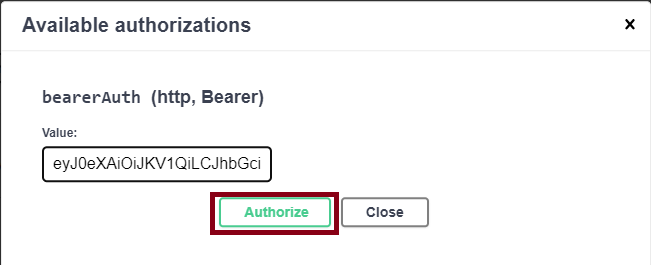

# Quick Start (TSBaaS)

:::tip SKA

If you new to develop applications with an Securosys-HSM's, you can get a developer account with Securosys for free. With this account you will receive your own partition on a Primus X-Series HSM and the necessary login credentials. This access is for development purposes only.

For more information please contact info@securosys.ch to get a developer account.

:::

## Initial Connection
The RestAPI is composed of HSMs in a high availability cluster configuration, please use one of the below parameters to connect.

| TSB Service | Description | Authentication | API-Endpoint |
|---|---|---|---|
| Demo | Demo | None | https://tsb-demo.cloudshsm.com/swagger-ui/index.html |
| Developer Program (DEV) |	TSB bound to Developer Program HSM partition | JWT | https://primusdev.cloudshsm.com/swagger-ui/index.html |
| Pre-Prod/Test & Integration (SBX) |	TSB bound to CloudsHSM SBX partition, stable system, **non-production** | JWT | https://sbx-rest-api.cloudshsm.com/swagger-ui/index.html |
| Production (ECO) | TSB bound to CloudsHSM ECO partition, **production** | JWT | https://rest-api.cloudshsm.com/swagger-ui/index.html |
| Dedicated (Platinum) | TSB bound to CloudsHSM PLA partition, **production** | mutualTLS | custom api endpoint |

## Open API in Browser

In the table above, select your service `https://<your-service-api-endpoint>/swagger-ui/index.html` to interact with the Rest-API in your browser.

For example: [http://localhost:8080/swagger-ui/index.html](http://localhost:8080/swagger-ui/index.html)

## Authentication

:::tip SKA

Only required if your are using Securosys CloudsHSM 
- [https://primusdev.cloudshsm.com](https://primusdev.cloudshsm.com/swagger-ui/index.html),
- [https://sbx-rest-api.cloudshsm.com](https://sbx-rest-api.cloudshsm.com/swagger-ui/index.html),
- [https://rest-api.cloudshsm.com](https://rest-api.cloudshsm.com/swagger-ui/index.html)

:::

To authenticate against the HSM via Rest-API and to access your HSM-Partition, follow the below steps:

1. Click `Authorize`  

2. Enter the `JWT-Token`   

3. Click `Authorize` & `Close`

## What's next?

- Follow the instructions to [ Create a Key and use it to encrypt and decrypt a payload](../5_Tutorials/EncryptDecrypt.md)
- A few more request samples [`docusaurus.config.js`](https://docusaurus.io/docs/api/docusaurus-config)
- Rest-API [Capabilities and Functions](./1_TSB-Installation-OnPremises.md)
