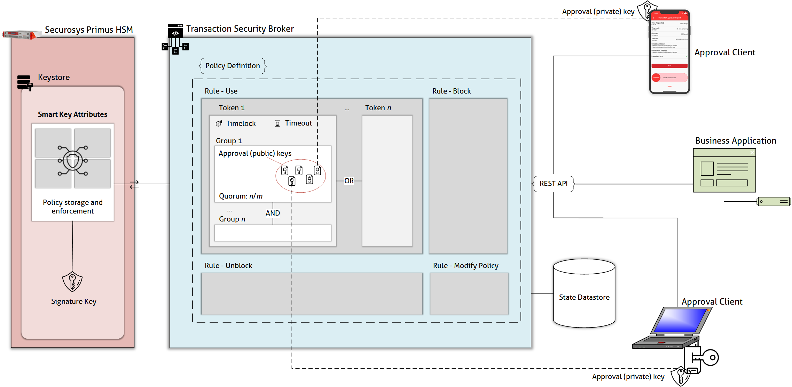

# Smart Key Attributes

# 1. Table of Contents

[2.1 Intoduction](#21-introduction)

[2.2 Glossary](#22-glossary)

[2.3 Workflow Process ](#23-workflow-process)

[2.4 Smart Key Attribute - Policy ](#24-smart-key-attribute---policy)

[2.5 Tutorial ](#25-tutorial)

# 2 Transaction Security Broker

## 2.1 Introduction
Transaction Security Broker integrates the REST API with the Securosys Smart Key Attributes (SKA) workflow engine. It makes integration of SKAs simple by providing the language-agnostic interface and maintaining the state of the requests and approvals lifecycle.\n

Securosys Smart Key Attributes allow for the level of control over the private key operations required by some of the most security critical systems dealing with crypto- asset custody, large payment and trade processing, or personal data and digital identity protection. To achieve this, SKAs wrap private keys with policies defining the rules based on which the key operations can be performed, blocked, or unblocked, or which define how these policies can be changed. These attributes are stored and enforced by the Securosys Primus HSM in the same secure container in which the keys themseves are protected.\n

Note: The TSB instance in use may require JSON Web Token (JWT) authentication. Refer to section 1.2 of this page to understand how to use JWT

## 2.2 Glossary

| Term | Description |
|---|---|
| Signature Key | HSM Key used for signing a payload (e.g. cryptocurrency transaction) |
| Key Action | One of the following actions with the Signature Key: <br /> • Using the key to sign a payload (use) <br /> • Blocking the key from performing signature operations (block) <br /> • Unblocking the blocked key (unblock) <br /> • Modifying the Key Attributes (modify) 
| Approval Key | Key used to approve signature Key Actions |
| Quorum | Required number of Approval Keys to perform an Action. <br /> __Note: When working with SKAs directly, it is necessary to maintain the state of the approval request and submit it when the quorum is met. Transaction Security Broker maintains the state for the business application automatically.__
| Group (of Approval Keys) | List of keys from which a quorum is required to perform an Action. Multiple groups, each with its own quorum can be defined with AND relationship. |
| Timelock | Minimum time between a timestamp obtained for a Key Action from the HSM and submitting an approval for the Action. <br /> Note: When working with SKAs directly, it is necessary to obtain the timestamp and submit the approval at the right time manually. Transaction Security Broker manages the re- quests and timelocks automatically. |
| Timeout | Maximum time between a timestamp obtained for a Key Action from the HSM and submitting an approval for the Action. |
| Token | Set of requirements to perform a Key Action. Includes Timelock, Timeout, and Groups. Multiple Tokens can be defined with OR relationship |
| Rule | Multiple tokens defined for a key operation. | 
| Approval Policy | Set of rules for each Key Action |
| Approval Request | A request to sign a Key Action with an Approval Key |
| Approval Client | A device using Approval Keys to sign Approval Requests |


## 2.3 Workflow Process



The approval process looks as follows:

1. A business application requests an approval for a signature with a specific key from the TSB (/sign)

2. The TSB records a Signature Request and returns its ID

3. The approval clients can retrieve their pending approval tasks with all information necessary to approve them (/filteredSignApprovalTask)

4. The approval client sends an approval of the signature request (/approval)

5. The TSB waits for the rules to be met, then sends the required authorization data along with the payload to the HSM.

6. The HSM checks the authorization data against the key attributes and the specific payload. If the criteria are met, the HSM signs the payload and returns the signature to the TSB

7. The TSB makes the signature available for the business application to fetch (/request/`<request_id>`)

## 2.4 Smart Key Attribute - Policy

The following approval criteria can be defined:

•	**Groups and quorums** - **n** out of **m** authorization is required and combined in any number of groups;

•	**Delay** - the minimum time between when the HSM receives the authorization requests and when it can sign the payload;

•	**Timeout** - the maximum time between raising the request and its authorization;<br /><br />


The criteria are combined in a token and there can be multiple tokens for each rule. The rules define the criteria for all actions with the key:

•	**Usage** (The rule usage defines the usage of the key, e.g. signature-operation, decryption-operation)

•	**Key blocking**

•	**Key unblocking**

•	**Modify** Change of the authorization attributes (rules)

Each key can have its own individual policy.

## 2.5 Tutorial

### Create an RSA Key with one Approver on RuleUse

:::tip Create RSA Key with Policy

The script [Create RSA Key](../resources/ska/rsa/create_rsa.sh "create_rsa.sh") creates a RSA approval key locally (approver.pem) attaches the `certificate` to the policy of the HSM Key and generates the Create Key request to be sent to TSB.<br />

Execution: `./create_rsa.sh approverx`

The output of the script should be sent to the endpoint: `POST /v1/key`<br />
:::

#### Request
POST: /v1/key
```js
{
  "label": "TSB_TUTORIAL_1-RSA",       # Label must be unique and is used for any request of the key action
  "algorithm": "RSA",
  "keySize" : 2048,                    # keySize is required for RSA
  "attributes": {                      # For this example, we'll assume the key will be used only for signing. We also rely on defaults for most attributes (see in response)
      "decrypt": false,
      "sign": true,
      "unwrap": false,
      "destroyable": true 
  },
  "policy": {                          # To better understand structure of the policies, refer to the concept diagram
      "ruleUse": {                     # We'll set a very simple policy - 1/1 approval with no timelock and a 10 minute timeout
          "tokens": [
              {
                  "name": "Token1",
                  "timelock": 0,
                  "timeout": 3600,     # Time restrictions are defined in seconds and must be multiples of 60
                  "groups": [
                      {
                          "name": "Group1",
                          "quorum": 1,  # Quorum of 1 means that only 1 approver needs to sign in order to get a request EXECUTED
                          "approvals": [
                              {
                                  "type": "certificate",
                                  "value": "MIIDAjCCAeoCCQCcSLgNCjDsRzANBgkqhkiG9w0BAQsFADBDMQswCQYDVQQGEwJDSDEPMA0GA1UECAwGWnVyaWNoMQ8wDQYDVQQHDAZadXJpY2gxEjAQBgNVBAoMCVNlY3Vyb3N5czAeFw0yMDA1MTExNDI5MDdaFw0yMTA1MTExNDI5MDdaMEMxCzAJBgNVBAYTAkNIMQ8wDQYDVQQIDAZadXJpY2gxDzANBgNVBAcMBlp1cmljaDESMBAGA1UECgwJU2VjdXJvc3lzMIIBIjANBgkqhkiG9w0BAQEFAAOCAQ8AMIIBCgKCAQEArA0bxSqhL7xfvcHbKKa8wMTMsIeJfYRdIgPxp5cU9JcmV86kyfpyRcSNSi44LVeNmAi94F3OZrXXi6CZvWrFL+VcewUtUSu+kG5oLJ9T4O6R2I5GO2Ev1HJnK3WfHOsFKFxLGzmKyjEkSLGgopY+Nh74K8Q6yxsvQPETOs9TzQiUXFYlfEZnbjUWG4eAgW9WWEopmK/X295ToOuTHFzmzO00btkjAy6vwWOabCE4kaJg+bCNW1snZz84uonr60rB9H0Mj98RbTfbDyMh6cIkaj8WrXeaYh4fxQYXApYu3nzhe3Q1bNCzV5M68rCsgVrmWcK/xUhM9BK6QHSwS/l76wIDAQABMA0GCSqGSIb3DQEBCwUAA4IBAQBNmg+gx2mH+fkU/dtM+tDvMIj2SY4pNU8H144aRY9I5kARN7Uwp+zRfJC+rCxrrYxXmx/OD+mIrTAHxPd5WuUWgULB6DXPho5Tyl4Czt6qOuzl7Qp7n1G9R/evZCPyEHflcGVEko/uCL5N8Ch9YboW5QwTrdftnL+zLLC5nON7KUCqbtVrDSdeMKF+dHKTX4Z90gdbv1C8x1fMWrsaoNw194DNBZCTVe4Di69xz3lHNEWVZ460mqKg0n5010VfEQqA92ceNJhjl4hgNMH9+asdBVAWmt0gk4PJUbqtuOKGKyxqi2k9QX8N2tjlsuMJmwRIw2YsZN4EKqQZ+0NAn1N7"
								                            # Certificate or PublicKey values must be provided without new lines
                              }
                          ]
                      }
                  ]
              }
          ]
      },
    "keyStatus": {                     # Make sure this is inside of policy object
        "blocked": false               # If setting this to true, make sure ruleUnblock is defined
    }
  }
}
```

## Issue a Signature Request

:::tip Create RSA Approval Key

This request is the actual sign request.<br /><br />
As the Key specified is an SKA key (key with policy), the sign request is not executed immediately. The request need to be approved by the previous created approver `approverx` defined in the `ruleUse` in the SKA-Keys policy.
:::


#### Request
POST: /v1/sign

```js
{
  "signRequest": {
    "payload": "QXBwcm92ZVNpZ25UYXNrUGF5bG9hZA==",     # base64 encoded payload
    "payloadType": "UNSPECIFIED",
    "signKeyName": "TSB_TUTORIAL_1-RSA", # adjust the keyname to your previously created key defined as `label` in POST: /v1/key
    "signatureAlgorithm": "SHA256_WITH_RSA"
  }
}
```

#### Response
Status: 201
```js
{
  "signRequestId": "4e8731d8-0ae6-4444-8a8c-b73ab5f0ba18"    # this will be used to retrieve the actual signature in the last step
}
```

## Fetch an approval task from previously created signature request

To approve the original sign request, you need to solve a challenge first.

:::tip Fetch Approval Task

The script [Sign Timestamp](../resources/ska/rsa/sign_timestamp_rsa.sh "sign_timestamp_rsa.sh")  signs the current Timestamp `"timestamp": "2023-10-30T17:30:24+00:00",` with the approvers private key and generates a request-body to be sent to TSB.

Execution: `./sign_timestamp_rsa.sh approverx`

The output of the script should be sent to the endpoint: `/v1/filteredSignApprovalTask` to fetch the challenge<br />
:::


#### Request
POST /v1/filteredSignApprovalTask

```js
{
  "timestamp": "2023-10-30T17:30:24+00:00",
  "timestampSignature": "VuZ0f/VEM2iq0zGCAVFTgWWD5zLJGCtUs/Eh3ecz4lYXSU42TwTWjwL6EQ4SHXf2gYZoci5q5nwswxkd0i4gvQ5fKd3lM8RzleDUziWqicrak65guIKynYuOvvYE29yqkwQ20N4FTKHAoseokIch8ByhxTeURFAinWHJZ9Rhf9ShojGn5f5/sP6G8C7WHMOaOB7f5e+FrjRfQs660rVaVjQU6XKmRrtKHsQQcMTz2Npm4/ikBolVSUXV4ZWUofA8ZR3+/aBsINw/CALnNIp+9mU6WEbneRz6nK1/LWV/VMT8A9J4gEo8GIGGSCFWlbq2P6DxTxLSHByEiNelYxOkqA==",
  "approverCertificate": "MIIDUTCCAjmgAwIBAgIUVyyrH8t8ldAUzHaYAyavN7mK6lMwDQYJKoZIhvcNAQELBQAwODELMAkGA1UEBhMCQ0gxDTALBgNVBAoMBFRlc3QxGjAYBgNVBAMMEVNLQSBUZXN0IDIwMjMgUlNBMB4XDTIzMTAzMDE1MjIxMFoXDTI0MTAyOTE1MjIxMFowODELMAkGA1UEBhMCQ0gxDTALBgNVBAoMBFRlc3QxGjAYBgNVBAMMEVNLQSBUZXN0IDIwMjMgUlNBMIIBIjANBgkqhkiG9w0BAQEFAAOCAQ8AMIIBCgKCAQEAuUy1tRrrO5xf6576qAJlLHX3HLGP7AKLfHW0TRGXfLP+ngFiSF4qAQdeU7rDtoY0QbjPazqFr8E9wuvjZX4B8xDEPPlECEO+7ixmeb0CX1HtZrES4b9CJuYunBl/ENNujnXH0pE9yw5/SiIxujISyNZmorDIurMsi7JYreq3ZOj8IisMDHVNfJKPV4QMOWKGtUfj/s7EdQ9H6pEvZcmy/Z9PyYWSCDcID4lrMg/FfdZRwvp9OcouypKOoDKf0pK2K0eYZQtnLZzHA+KI3xTjrpRFHtfufnKd9hozndp3OkZv8ZJFfjJ55RXL1K/ZqHSNSsmOxcGzzfNwI0+S/BjYtQIDAQABo1MwUTAdBgNVHQ4EFgQU261gJf0Ta1kqLevzofEU/vqbY9MwHwYDVR0jBBgwFoAU261gJf0Ta1kqLevzofEU/vqbY9MwDwYDVR0TAQH/BAUwAwEB/zANBgkqhkiG9w0BAQsFAAOCAQEAbjTisq3rwCcomv4BD2j0DFm+pS3uUDFgGkOci93XSq89rJaWw4mUcQDhdU8rXjm5hNT+XoPND80sv/LwnCVUAXmhGiwwjXNcIORje+5z/Wys+jmPfOrfrzOaoOQEFw5ZQY3SgSQaEN+pmQr4HhorGnlY8aWIQ5XEgx7scebRQI6xx8zeQID20IJTElHby5haCdtaAO9BR+E3U6NnPyr9gFDn0YAf/OfadpaI1beu5TBBj5k9e7+Yzidp+BboolWhvPLSoMlmrTlgwl6Tub/ZQdAelUD0sks5hqZbCjO1/FPIrDgRP57pUw3+EKbDwfpaIOdQGMjr4I/+nAPuWd5s1A==",
  "timestampDigestAlgorithm": "SHA-256",
  "detailLevel": "level1",
  "paging": {
    "pageNumber": 0,
    "pageSize": 1,
    "sortOrder": "CREATION_DATE_ASC"
  }
}
```

#### Response
Status: 200
```js
{
  "tasks": [
    {
      "detailLevel": "level1",
      "id": "6947856a-e3a1-44cf-bb99-bbd2995642ca",     # the id of the challenge
      "approvalToBeSigned": "4AAAADsABAABAAAAAhASAFRTQl9UVVRPUklBTF8xLVJTQQAAVBBAADwAAABXEBYAQXBwcm92ZVNpZ25UYXNrUGF5bG9hZAAABwEIANcU814AAAAAAhANAHRpbWVzdGFtcC1rZXkAAABWEFkAMFcwDAYIKoZIzj0EAwIFAANHADBEAiADPniQDGELMUTqJCJ17kW3bUInXIf8dy9mwsseJ7voJAIgK3Kh4JjkR+RDugYKlp4x3M6UQIXkyQ5OuavkL0V5b5sAAABXEBYAQXBwcm92ZVNpZ25UYXNrUGF5bG9hZAAA"
                                                        # the challenge payload (challenge to be signed)
    }
  ]
}
```

## Send Approval

This step signs the challenge (`approvalToBeSigned` from the previous step) and herewith sents an approval

:::tip Fetch Approval Task

The script [Sign Approval Challenge](../resources/ska/rsa/sign_rsa.sh "sign_rsa.sh")  signs the `approvalToBeSigned` from the previous step, with the approvers private key. Again use the following script to generate the next request body.


Execution: `./sign_rsa.sh approverx 6947856a-e3a1-44cf-bb99-bbd2995642ca 4AAAADsABAABAAAAAhASAFRTQl9UVVRPUklBTF8xLVJTQQAAVBBAADwAAABXEBYAQXBwcm92ZVNpZ25UYXNrUGF5bG9hZAAABwEIANcU814AAAAAAhANAHRpbWVzdGFtcC1rZXkAAABWEFkAMFcwDAYIKoZIzj0EAwIFAANHADBEAiADPniQDGELMUTqJCJ17kW3bUInXIf8dy9mwsseJ7voJAIgK3Kh4JjkR+RDugYKlp4x3M6UQIXkyQ5OuavkL0V5b5sAAABXEBYAQXBwcm92ZVNpZ25UYXNrUGF5bG9hZAAA`

The output of the script should be sent to the endpoint: `/v1/approval` to submit the approval.

:::

#### Request
POST /v1/approval

```js
{
  "id": "6947856a-e3a1-44cf-bb99-bbd2995642ca", 
                                # The id of the task from the previous response: /v1/filteredSignApprovalTask
  "approvalToBeSigned": "4AAAADsABAABAAAAAhASAFRTQl9UVVRPUklBTF8xLVJTQQAAVBBAADwAAABXEBYAQXBwcm92ZVNpZ25UYXNrUGF5bG9hZAAABwEIANcU814AAAAAAhANAHRpbWVzdGFtcC1rZXkAAABWEFkAMFcwDAYIKoZIzj0EAwIFAANHADBEAiADPniQDGELMUTqJCJ17kW3bUInXIf8dy9mwsseJ7voJAIgK3Kh4JjkR+RDugYKlp4x3M6UQIXkyQ5OuavkL0V5b5sAAABXEBYAQXBwcm92ZVNpZ25UYXNrUGF5bG9hZAAA",
                                # The approvalToBeSigned has to be decoded from base64 before being signed (sign_rsa.sh does for you)
  "signature": "Mn/DQgm2yQbmFgcsEB+v3ACJgIbVo6IFSa7bDfMXmQXJZU21lVE0Bv46dTN6D4oWU/LYTuUYcIXmmRMChVgvRQvF254CctvDww99/ZUB+RrJ5LKE4t4gbHMgORntY/u3lM1CtmD5LwxONcB+3FwIyiODGPiDtfabgAucoGQ1X3Gdvn6KuESfFxtQfr3yn/FcMHBCGZDPPCIDDRaql3u9rI81emhyh7Oi1iXEypHAi9jzAUWRjnFCFtbOOs5MERN+54HxZF8wfY58aZLlHPF0GIhpC9+92NS7GRe0oO+gwlYX43NvewHwitTUMBE0ctd5xoNDkhuu8zMPTJJwiHqbmA==",
  "approvalDigestAlgorithm": "SHA-256",
  "approverCertificate":"MIIDAjCCAeoCCQCcSLgNCjDsRzANBgkqhkiG9w0BAQsFADBDMQswCQYDVQQGEwJDSDEPMA0GA1UECAwGWnVyaWNoMQ8wDQYDVQQHDAZadXJpY2gxEjAQBgNVBAoMCVNlY3Vyb3N5czAeFw0yMDA1MTExNDI5MDdaFw0yMTA1MTExNDI5MDdaMEMxCzAJBgNVBAYTAkNIMQ8wDQYDVQQIDAZadXJpY2gxDzANBgNVBAcMBlp1cmljaDESMBAGA1UECgwJU2VjdXJvc3lzMIIBIjANBgkqhkiG9w0BAQEFAAOCAQ8AMIIBCgKCAQEArA0bxSqhL7xfvcHbKKa8wMTMsIeJfYRdIgPxp5cU9JcmV86kyfpyRcSNSi44LVeNmAi94F3OZrXXi6CZvWrFL+VcewUtUSu+kG5oLJ9T4O6R2I5GO2Ev1HJnK3WfHOsFKFxLGzmKyjEkSLGgopY+Nh74K8Q6yxsvQPETOs9TzQiUXFYlfEZnbjUWG4eAgW9WWEopmK/X295ToOuTHFzmzO00btkjAy6vwWOabCE4kaJg+bCNW1snZz84uonr60rB9H0Mj98RbTfbDyMh6cIkaj8WrXeaYh4fxQYXApYu3nzhe3Q1bNCzV5M68rCsgVrmWcK/xUhM9BK6QHSwS/l76wIDAQABMA0GCSqGSIb3DQEBCwUAA4IBAQBNmg+gx2mH+fkU/dtM+tDvMIj2SY4pNU8H144aRY9I5kARN7Uwp+zRfJC+rCxrrYxXmx/OD+mIrTAHxPd5WuUWgULB6DXPho5Tyl4Czt6qOuzl7Qp7n1G9R/evZCPyEHflcGVEko/uCL5N8Ch9YboW5QwTrdftnL+zLLC5nON7KUCqbtVrDSdeMKF+dHKTX4Z90gdbv1C8x1fMWrsaoNw194DNBZCTVe4Di69xz3lHNEWVZ460mqKg0n5010VfEQqA92ceNJhjl4hgNMH9+asdBVAWmt0gk4PJUbqtuOKGKyxqi2k9QX8N2tjlsuMJmwRIw2YsZN4EKqQZ+0NAn1N7"
                                # The approvers certificate / public key 
}
```

#### Response
Status: 200


## Get the approved signature

:::tip Fetch Approval Task

Replace the `{id}` with the id returned in the first request, e.g. `4e8731d8-0ae6-4444-8a8c-b73ab5f0ba18`

:::

#### Request
```
GET: /v1/request/{id}
```


#### Response
Status: 200

```js
{
  "id": "4e8731d8-0ae6-4444-8a8c-b73ab5f0ba18",
  "status": "EXECUTED",
  "executionTime": "2020-06-24T08:54:47Z",
  "approvedBy": [
    "MIIBIjANBgkqhkiG9w0BAQEFAAOCAQ8AMIIBCgKCAQEArA0bxSqhL7xfvcHbKKa8wMTMsIeJfYRdIgPxp5cU9JcmV86kyfpyRcSNSi44LVeNmAi94F3OZrXXi6CZvWrFL+VcewUtUSu+kG5oLJ9T4O6R2I5GO2Ev1HJnK3WfHOsFKFxLGzmKyjEkSLGgopY+Nh74K8Q6yxsvQPETOs9TzQiUXFYlfEZnbjUWG4eAgW9WWEopmK/X295ToOuTHFzmzO00btkjAy6vwWOabCE4kaJg+bCNW1snZz84uonr60rB9H0Mj98RbTfbDyMh6cIkaj8WrXeaYh4fxQYXApYu3nzhe3Q1bNCzV5M68rCsgVrmWcK/xUhM9BK6QHSwS/l76wIDAQAB"
  ],
  "notYetApprovedBy": [],
  "rejectedBy": [],
  "result": "H3bq8PdgSiAlhB0kt1RSD6a3JYXZoj/dz3Nb/MHlgISnmh6x3TPtnV+9mUnw8PV2Ss1pq8txdMOBg9SF8uaKyUvFtLl/QFHIgllm/Q/uvrjaM205Cdz1uaSLePXaNXeC012l1sqlhnyqGKxKTKejMngzNHAnOpwU7kGCEpKPFWL5ltaBRYd3Q/I/F9IufAsKHj+3ky/p6tYN5VPhJSKiSE2YuVyOzGPHY40ipVo/7deBtUUjZmaZAgVQNC1mC79LOhIHLj8Ce4i41CbFZA+ZSMe+nx5bP/7uPA+kbGAjvNS3KLOFeZJ2OJCkTuThsXVh7rTp9tVqYqHU1LZm8f9bYA=="
}
```

If the quorum has been filled the request status is `EXECUTED` and the `result` contains the actual signature.