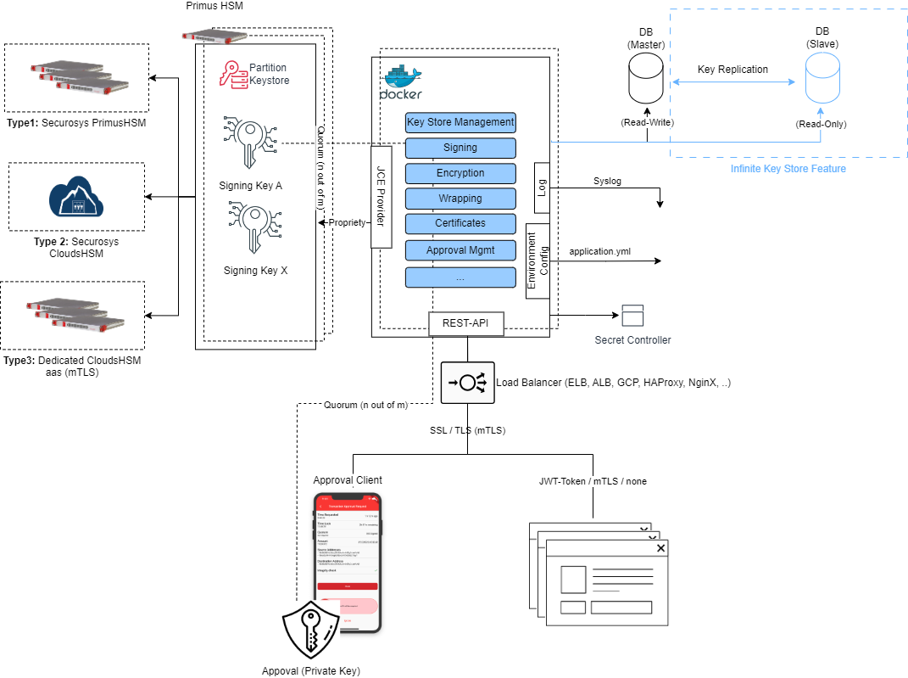

# Overview

The Transaction Security Broker Software is the Restful interface for PrimusHSM and delivered as a set of Docker containers. It establishes connections to a Database for state management, an HSM (Hardware Security Module) cluster for key operations and policy enforcement, and utilizes various logging mechanisms to capture relevant information.

## Glossary
| Term | Description |
|---|---|
| TSB | Transaction Securtiy Broker |
| SKA | Smart Key Attributes |

## What's next?

- Read the [QuickStart Guide](./TSB/1_Get-Started/0_TSB-Quickstart.md)
- Request Samples (Rest-API) [`docusaurus.config.js`](https://docusaurus.io/docs/api/docusaurus-config)
- Approval Workflow [`themeConfig`](https://docusaurus.io/docs/api/themes/configuration)
- Read the [official Deployment Guide](./TSB/2_Installation-Userguide/On-Premise-Installation.md)
